\page Kandidaten_8md Kandidaten 👥

\tableofcontents

Auf dieser Seite stellen sich unsere Kandidatinnen und
Kandidaten für den Gemeinderat vor.

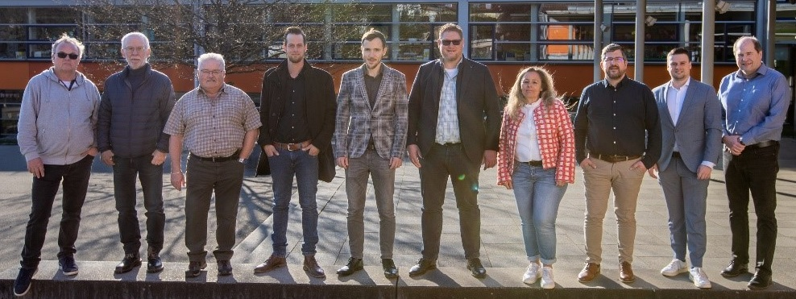

## Marc Behringer

- 30 Jahre
- Student (Gymnasiales Lehramt)
- ledig

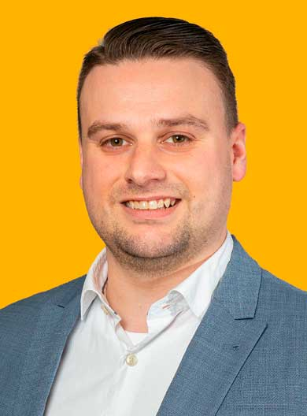

Mit meiner Kandidatur für den Hochdorfer
Gemeinderat möchte ich mein aktuelles
kommunalpolitische Engagement weiterführen
und unter anderem die Projekte, die
in der letzten Wahlperiode initiiert wurden,
weiterverfolgen und begleiten sowie den
frischen Wind in neue Projekte und aktuellen
Themen weiter einbringen.

Meine besonderen Anliegen in der kommunalpolitischen
Arbeit sind dabei: Das generationsübergreifende,
dörfl iche Zusammenleben
und die Gemeinschaft in der Gemeinde
zu stärken.
Ich möchte mich weiterhin für die Stärkung
des Ehrenamtes und des Vereinslebens
einsetzen. Ebenso sind mir die Bereiche
Bildung, Schulentwicklung und auch die Kinderbetreuung
ein wichtiges Anliegen. Auch
sind mir Themen wie Umweltbewusstsein,
Nachhaltigkeit sowie die Erlebbarmachung
der Natur und entsprechendes Verantwortungsbewusstsein
wichtig.

Motivation für die Tätigkeit im Gemeinderat
nehme ich aus den vergangenen fünf Jahren,
in denen ich als Mitglied der CDU-Gemeinderatsfraktion
die Interessen der Bürgerinnen
und Bürger vertreten durfte. Hierbei haben
mich die Erfahrungen aus meiner Zeit als 1.
Vorsitzender der Jungen Union Neckar-Fils
und aus meiner Zeit als Beisitzer im Kreisvorstand
der Jungen Union Esslingen sowie
aus meinen anderen ehrenamtlichen Tätigkeiten
motiviert.

Ich übernehme gerne Verantwortung und
setze mich für meine Mitmenschen ein,
deshalb bin ich in der Feuerwehr Hochdorf
und dem Deutschen Roten Kreuz ehrenamtlich
aktiv und dort in verschieden Ämter und
Funktionen engagiert. Die Erfahrungen aus
meinen ehrenamtlichen Tätigkeiten motivieren
mich zusätzlich für die Tätigkeit im
Hochdorfer Gemeinderat.

## Dieter Bek

- 69 Jahre
- Dipl.-Ing. Maschinenbau
- Gemeinderat seit 2015
- Erster Vorsitzender des Kleintierzüchtervereines Hochdorf
- Mitglied in der AGHV-Vorstandschaft und Mitglied mehreren Vereinen
- verheiratet, 1 Tochter

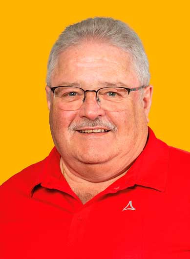

Ich bin in Hochdorf geboren und fühle mich,
mit meiner zwischenzeitlich größer gewordenen
Familie, nach wie vor sehr wohl. Da
mir Hochdorf sehr wichtig ist, habe ich mich
schon immer für unsere Gemeinschaft mit
ehrenamtlichen Tätigkeiten engagiert und
bin in mehreren Vereinen aktiv.

Um unser Hochdorf weiterzuentwickeln und
für die Zukunft fi t zu machen, ist es heute
mehr den ja wichtig mit soliden Finanzen
vernünftige Investitionen zu tätigen. Leider
werden von der großen Politik im mehr
Aufgaben auf die Kommunen abgewälzt, das
den fi nanziellen Spielraum von Hochdorf in
den nächsten Jahren erheblich einschränkt.
Es gibt deshalb sehr viele Aufgaben, die in
guter Zusammenarbeit gemeinsam gelöst
werden müssen.

Dafür möchte ich mich wieder mit meiner
Erfahrung als Gemeinderat einsetzten.

## Regina Bönisch

- 58 Jahre
- Rektorin
- verheiratet, 1 Sohn

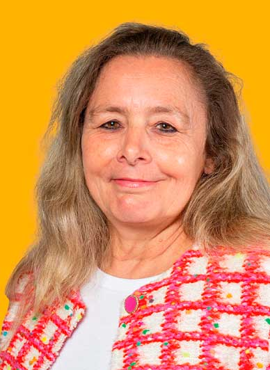

Meine persönlichen Erfahrungen aus Beruf,
Ehrenamt und früherer Gemeinderatstätigkeit
möchte ich zukünftig in die Arbeit des
Hochdorfer Gemeinderats einbringen.

Die Interessen der Bürgerinnen und Bürger
aller Altersgruppen zu vertreten ist mir
wichtig sowie bisher Erreichtes zu bewahren
und Anstehendes zeitgemäß weiterzuentwickeln.

Die aktuellen gesellschaftlichen Veränderungen
gilt es im Blick zu behalten, um
zukunftsorientierte und nachhaltige Entscheidungen
zu treffen. Wichtige Punkte
in der Gemeindepolitik sind für mich im
Besonderen: dörfl iche Strukturen erhalten
und stärken. guten Wohn- und Lebensraum
für jüngere Generationen sowie für Ältere
ebenso generationsübergreifende Projekte.

Auf Grund meiner persönlichen Erfahrungen
als Schulleiterin liegen mir die Themen
„Bildung“, „Schule“ sowie „Kinderbetreuung“
besonders am Herzen. Mit ist es als
gebürtige Hochdorferin ein Anliegen, mich
für meine Gemeinde einzusetzen und Verantwortung
zu übernehmen.

Meine Erfahrungen aus Beruf, Familie,
Ehrenamt und Freizeit bilden aus meiner
Sicht eine gute Grundlage für eine zukunftsorientierte
Gemeinderatsarbeit.

## Frank Dietrich

- 63 Jahre
- Dipl.-Ing. (FH)/ Betriebswirt (VWL)
- verwitwet, 1 Tochter

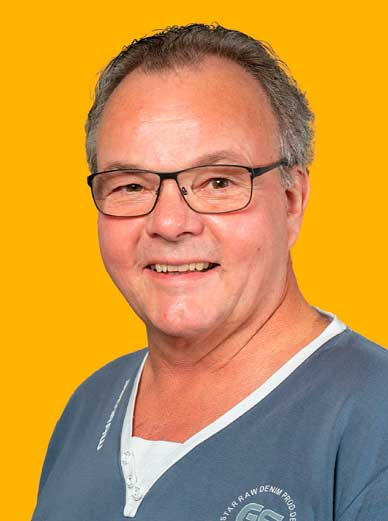

Mich – Frank Dietrich – hat es vor sieben
Jahren nach Hochdorf verschlagen.
Eine erfolgreiche berufl iche Laufbahn als
Diplom-Ingenieur und Betriebswirt neigt
sich dem Ende zu. So kann ich Erfahrung
und Zeit in die Gemeindearbeit einbringen.

Besonderes Augenmerk möchte ich richten
auf technische Themen im Rahmen der Beschaffung.
Hier hilft mir meine jahrelange
Erfahrung als Einkäufer in der Automobilindustrie
und im Maschinen- und Anlagenbau.

Wichtig ist mir die Verbindung von Wirtschaftlichkeit
der Ausgaben und deren
Finanzierbarkeit. Mein Credo heißt: Nicht
immer nur von anderen fordern, sondern
sich auch selbst engagieren – zum Wohle
von Hochdorf und seinen liebenswürdigen
Menschen

## Mike Feistel

- 38 Jahre
- Leiter Marketing und strategische E-Commerce Entwicklung
- verheiratet, 2 Kinder

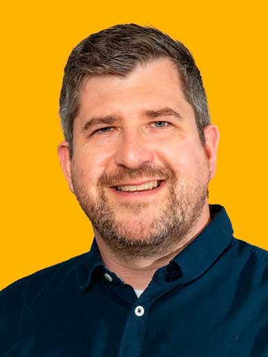

Hochdorf ist meine Heimat, mein Zuhause,
hier fühle ich mich wohl.
Aus diesen Gründen möchte ich mich für
unser Hochdorf als Mitglied des Gemeinderats
engagieren und einsetzen.

Als Familienvater ist es mir wichtig, dass
unsere Kinder innerhalb der Gemeinde die
Möglichkeit haben, sicher und geborgen
aufwachsen zu können. Hierzu kann auch
die Gemeinde einen wesentlichen Teil dazu
beitragen. Zukunftsorientierte Angebote
in der Kinderbetreuung sind dabei ebenso
wichtig, wie öffentliche Spiel- und Freizeitangebote
sowie die Förderung von Jugendarbeit
unserer tollen Vereine.

Als Hochdorfer ist es mir aber auch wichtig,
mich für unsere heutigen und auch zukünftigen
Senioren einzusetzen. Denn diese haben
dazu beigetragen, dass unser Hochdorf
heute so lebens- und liebenswert ist.

Eine stabile Infrastruktur wie altersgerechtes
Wohnen, eine gute Lebensmittelversorgung
und eine gut ausgebaute ÖPNV-Anbindung
sind wichtige Voraussetzungen.
Um vernünftige und sinnvolle Projekte umsetzen
zu können, bedarf es einer soliden,
zielgerichteten Finanzplanung mit Augenmaß.
Hierfür steht die CDU, hierfür stehe
ich.
Am 09. Juni sind Gemeinderatswahlen. Gestalten
Sie mit, gehen Sie wählen.

Ich würde mich über Ihren Vertrauensvorschuss
freuen. Geben Sie mir mit Ihrer
Stimme die Möglichkeit, mich in den nächsten
5 Jahren für Sie – für unser Hochdorf
einsetzen zu dürfen.

## Gustav Hanisch

- 73 Jahre
- Dipl.-Ing. Metallkunde
- verheiratet, 1 Sohn

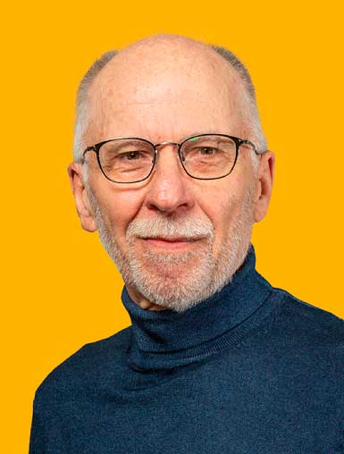

Liebe Hochdorferinnen und Hochdorfer,

ich bin Gustav Hanisch und lebe nach
vielen Stationen in jungen Jahren seit
nun 37 Jahren in Hochdorf. 26 Jahre habe
ich davon mit meiner Familie auf dem
Ziegelhof gewohnt. Bedingt durch meinen
Lebensweg habe ich viele andere Gegenden
kennengelernt.

Umso mehr schätz ich mein Leben in
Hochdorf. Ich fühle mich hier so richtig
angekommen und emotional verwurzelt.
Man kann hier so richtig schön und ruhig
wohnen. Besonders gefällt mir dabei auch
einerseits die naturnahe Umgebung und
andererseits die doch gute Verkehrsvernetzung.

Im Falle meiner Wahl würde ich mich gerne
um die Belange und Sorgen einer jeden
einzelnen Hochdorferin und eines jeden
einzelnen Hochdorfers kümmern.

Mein besonderer Einsatz würde dabei der
Verbesserung der örtlichen Struktur in Hinblick
auf Einkaufsmöglichkeiten und Gastronomie
gelten Aufgrund meiner früheren
Berufstätigkeit habe ich eine Neigung zur
Bearbeitung von komplexen Zusammenhängen
und Aufgabenstellungen.

Im Falle meiner Wahl würde ich mich gerne
um die Möglichkeiten der Umsetzung von
Aufgabenstellungen aus dem OEK und der
kommunalen Wärmeplanung kümmern.

## Markus Krämer

- 49 Jahre
- staatl. geprüfter Elektrotechniker/ Projektleiter
- Schöffe am Amtsgericht Esslingen (Erwachsenen Strafrecht)
- geschieden, 2 Kinder
- Gemeinderat seit 2019 und Kandidat für den Kreistag

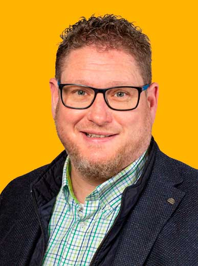

Als gebürtiger Hochdorfer liegt mir „onser
Flecka“ sehr am Herzen. Neben meinen
berufl ichen Erfahrungen möchte ich auch
meine organisatorischen Fähigkeiten aus
über 35 Jahren Vereinsleben mit einbringen.
Diese sind generationenübergreifend
und sehr wertvoll für mich.

Mein Engagement als Mitglied in einigen
örtlichen Vereinen zeigt, was Ehrenamt für
mich bedeutet und wie ich zu meinem Ort
stehe. Höhepunkte daraus waren für mich
sicher die langjährige Tätigkeit als Jugendleiter
und die des Festwarts.
Die Mitwirkung im Organisationsteam der
AGHV an bisher zwei Dorffesten unterstreichen
dies zusätzlich. Mir sind die Belange
aller Bürgerinnen und Bürger wichtig. Die
Transparenz der Gremienarbeit ist mir nach
wie vor ein Anliegen. Sie verhindert Unmut
und lässt wenig Platz für Spekulationen.

Als Vater von zwei Kindern muss man sich
auch für die jüngsten Gemeindemitglieder
interessieren und deren Interessen vertreten.
Die Weichen für deren Zukunft müssen
wir jetzt stellen, um gegenüber unseren
Nachbargemeinden mitzugehen.

Gerne möchte ich mich weiterhin für Ihr
Wohl im Gemeinderat engagieren und einsetzen.
Packen wir es gemeinsam an.

Gehen Sie am 09. Juni 2024 zur Wahl und
geben uns Ihre Stimmen.

## Rudolf Krämer

- 72 Jahre
- Polizeibeamter i. R.
- verheiratet, 1 Sohn

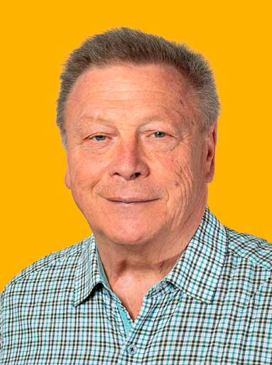

Als Mitglied in verschiedenen, örtlichen
Vereinen und Vorstand der Wanderfreunde
Hochdorfer Schnaken e.V. liegt mir, unter
anderem, die Jugend- und Vereinsarbeit
sehr am Herzen!

Ohne ehrenamtliches Engagement wären
viele Aufgaben nicht oder nur mit erheblichem
fi nanziellem Aufwand zu bewältigen,
weshalb die Unterstützung und Förderung
des Ehrenamtes in unserer Gesellschaft
immer wichtiger wird.

Gerne würde ich meine langjährige Erfahrung
im Gemeinderat zum Wohle der
Gemeinde einbringen.

## Markus Niebauer

- 56 Jahre
- Dipl.-Ing. (FH) Elektrotechnik
- Technischer Betriebsleiter im Immobilienbereich einer großen Bank im Land
- Verheiratet, 3 Kinder

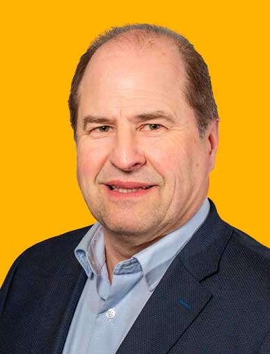

Als gebürtiger Hochdorfer fand ich sehr
schnell den Weg in den Musikverein in dem
ich mich seit Jahrzenten als Musiker, Jugendleiter
und Vorsitzender einbringe und
den Verein wie auch die Dorfgemeinschaft
mit prägte. Das einhundertjährige Jubiläum
des Vereines stellte dabei sicherlich ein
herausragendes Ereignis im Ort dar. In der
Funktion des Vizepräsidenten im Blasmusikverband
Esslingen e.V. vertrete ich nun
die Belange der Musikvereine im Kreis auf
Landesebene. Nicht nur als Vater dreier Kinder
ist mir die Entwicklung und Förderung
unserer Jugend seit jeher sehr wichtig. Hier
begleite ich für die IHK Stuttgart ehrenamtlich
als Prüfungsausschuss Vorsitzender
für Fachinformatiker seit Jahrzenten junge
Menschen in die Arbeitswelt. Berufl ich sorge
ich jeden Tag dafür, dass Tausende Mitarbeiter
von der KiTa über Kantinen, ärztlichem
Dienst und den Büroeinheiten eine funktionierende
und beschwerdefreie Gebäudeinfrastruktur
an ihren Arbeitsplätzen
vorfi nden. Ein besonderes Augenmerk habe
ich dabei auf einen Effi zienten und nachhaltigen
Gebäudebetrieb und unterstütze
dabei die Stadt Stuttgart bei ihren sehr
ambitionierten CO2 Reduzierungszielen. Mit
diesem Hintergrund ist es mir ein Anliegen
meine Erfahrung und meine Kenntnisse im
Sinne einer nachhaltigen und lebenswerten
Ortsentwicklung vor dem Hintergrund der
immensen Herausforderungen für Hochdorf
einbringen zu können. Dabei spielt für mich
neben der Stärkung der örtlichen Vereine
und Gemeinschaft die Sicherstellung der
Versorgung aller Generationen eine wichtige
Rolle - damit auch unsere Jugend eine Zukunft
im Ort und unserer Umwelt haben
kann.

Ich freue mich darauf, meinen Beitrag zu
einer positiven Entwicklung unseres Dorfes
leisten zu können – ganz wichtig: gehen
Sie am 09. Juni wählen und Danke für Ihre
Stimme.

## Simon Niebauer

- 35 Jahre
- B.Sc. Agrarwirtschaft
- verheiratet

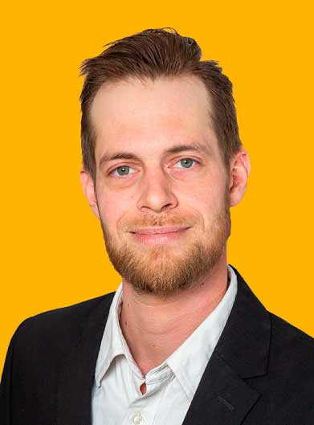

Liebe Mitbürgerinnen und Mitbürger,
am 09. Juni 2024 haben Sie die wichtige
Entscheidung, wer unsere Gemeinde in
den kommenden Jahren vertreten wird.
Ich möchte mich Ihnen als Kandidat für
den Gemeinderat vorstellen: Mein Name ist
Simon Niebauer, 35 Jahre alt, verheiratet.
Als engagierter Bürger unserer Gemeinde
liegt mir das Wohl unserer Gemeinschaft
besonders am Herzen.

Als Verfechter einer nachhaltigen Entwicklung
und einer verantwortungsvollen
Haushaltspolitik setze ich mich für eine
lebenswerte Zukunft für uns alle ein. Als
Hochdorfer in der 3. Generation weiß ich
um die Bedeutung einer familienfreundlichen
Gemeinde. Ich setze mich dafür ein,
dass Familien die Unterstützung und Infrastruktur
erhalten, die sie benötigen, sei es
durch den Ausbau von Betreuungseinrichtungen
oder die Schaffung und Erhaltung
von Freizeitmöglichkeiten für Jung und Alt.

Als Bewohner unseres wunderschönen Baden-
Württembergs liegt es mir am Herzen,
unsere Region zu stärken und weiterzuentwickeln.
Ich möchte mich dafür einsetzen,
dass unsere Gemeinde ihren Platz als
lebenswerter und attraktiver Ort behält und
dabei die Balance zwischen Tradition und
Innovation findet.

Gemeinsam mit Ihnen möchte ich die Herausforderungen
unserer Zeit meistern und
unsere Gemeinde zu einem Ort machen,
in dem sich alle Bürgerinnen und Bürger
wohl und sicher fühlen. Ihre Anliegen und
Ideen sind mir wichtig – ich stehe Ihnen
als Ansprechpartner zur Verfügung und
werde mich mit vollem Einsatz für unsere
Gemeinschaft einsetzen.

Herzlichst, Simon Niebauer Kandidat für
den Gemeinderat CDU-Fraktion

## Timo Unger

- 31 Jahre
- Softwareingenieur
- ledig

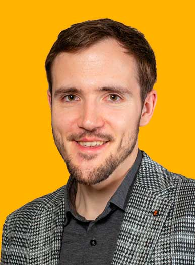

Die Aktivitäten, die in unserer Gemeinde
stattfinden, bestimmen, wie gerne wir hier
wohnen und leben. Die Entscheidung, welche
Veränderungen in Hochdorf umgesetzt
werden, liegt in den Händen des Gemeinderates.

Wie sich dieser zusammensetzt, bestimmen
Sie mit. Wählen Sie die Fraktionen oder
Personen, denen Sie diese Verantwortung
zutrauen. In Hochdorf bin ich großgeworden
und möchte es weiterhin sein.

Nicht nur körperlich, sondern auch durch
das Engagement für unserer Gemeinde.
Die Arbeit in den Vereinen und das Gefühl
der Zusammengehörigkeit liegen mir dabei
besonders am Herzen.

Im Musikverein mache ich gerne Musik und
bilde den Nachwuchs am Instrument aus.
Als Softwareingenieur beschäftige ich mich
gerne mit technischen Herausforderungen.
Diese Fähigkeiten und Erfahrungen helfen
mir, Vorschläge zu machen und die bestmöglichen
Entscheidungen zu treffen, die
uns weiterbringen.
