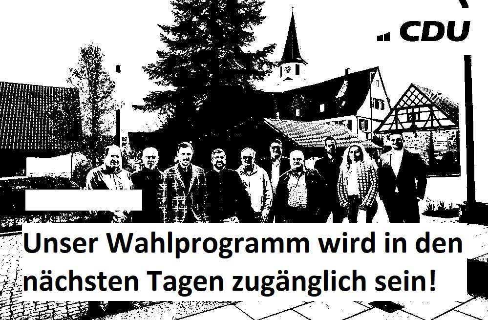
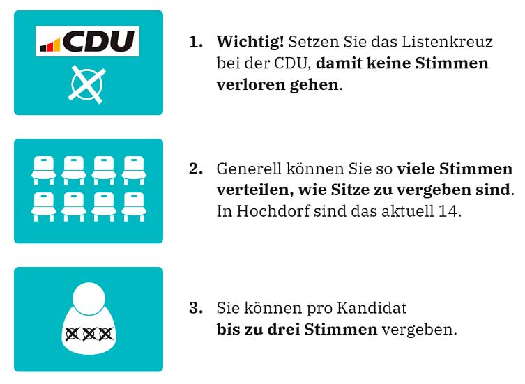

\mainpage Willkommen

## Liebe Bürgerinnen und Bürger von Hochdorf,

am 09. Juni 2024 stehen wichtige Wahlen an, bei denen Sie über die Aufstellung des Hochdorfer
Gemeinderats für die nächsten 5 Jahre entscheiden.

Auf unserem Wahlvorschlag fi nden Sie engagierte Personen, die mit Hochdorf eng verbunden
sind und vielfältige Kenntnisse und Erfahrungen aus den unterschiedlichsten Bereichen mitbringen.
Sie alle sind bereit, als Gemeinderäte Verantwortung zum Wohle unserer Gemeinde zu
übernehmen und im Dialog mit den Bürgerinnen und Bürgern zu handeln.

Auf den folgenden Seiten können Sie sich über unsere Kandidaten für den
Gemeinderat informieren.

Wir bitten alle Bürgerinnen und Bürger, von ihrem Wahlrecht Gebrauch zu
machen und uns ihre Stimmen zu geben. Die CDU wird auf verschiedenen
Plattformen wie Facebook, Instagram und anderen Medien Informationen
und Wahlaufrufe zur Verfügung stellen.

## So wählen Sie richtig:

## Hier können Sie mit uns Ihre Anliegen diskutieren:

- Bauernmarkt, am 04.05.
und 01.06. ab 09:00 Uhr
- Kandidatenvorstellung
in der Gaststätte Hasenheim,
am 16.05. ab 18:00 Uhr

Aktuelle Infos und Termine
finden Sie auf unserer Website.

### Inhalt

- [Kandidatenvorstellung](Kandidaten.md)
- [Rückblick](Thema00.md)
- [TOP 1: Öffentlichkeit & Transparenz](Thema01.md)
- [TOP 2: Baugebiet und Quartiersentwicklung](Thema02.md)
- [TOP 3: Talbachrenaturierung und Hochwasserschutz](Thema03.md)
- [TOP 4: Energieversorgung](Thema04.md)
- [TOP 5: Schule und Schulentwicklung](Thema05.md)
- [TOP 6: Digitalisierung](Thema06.md)
- [TOP 7: Finanzen der Gemeinde Hochdorf](Thema07.md)
- [TOP 8: Bürgerschaftlichen Engagement - Vereinsleben](Thema08.md)

[Download als PDF](https://github.com/cduhochdorf/Kommunalwahl2024/releases/download/Wahlprogramm2024/CDU-Hochdorf-Wahlprogramm2024.pdf)

[Download als mp3](https://github.com/cduhochdorf/Kommunalwahl2024/releases/download/Wahlprogramm2024/CDU-Hochdorf-Wahlprogramm2024.mp3)
