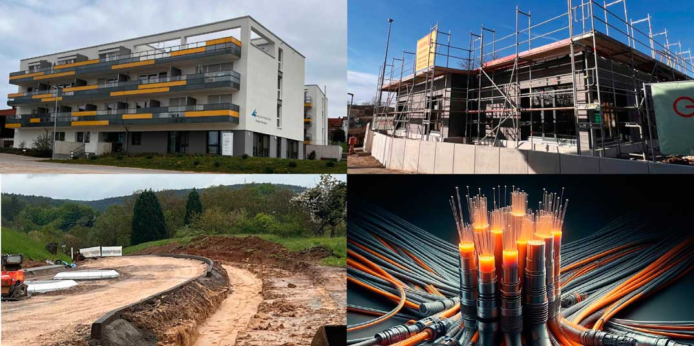

\page Thema00_8md Rückblick

## Umgesetzte und beauftragte Projekte des Hochdorfer Gemeinderates in den letzten 5 Jahren (Auszug)

- ✔️Parkplatz Kautzbühlstraße mit E-Ladestation mit Zusatzfunktion „Martinimarkt“
- ✔️Dorf- und Festplatzgestaltung, Infrastruktur für Feste, Bauernmarkt etc.
- ✔️Verbesserung ÖPNV, Anbindung Gewerbegebiet, Roßwälder Str. und Ortsteil Ziegelhof
- ✔️Car-Sharing „Deere“ (Planung abgeschlossen)
- ✔️Einlaufbauwerk und Rechen am Tobelbach erneuert und optimiert
- ✔️Radwegenetz ausgebaut
- ✔️Amalien-Residenz mit Schulmensa
- ✔️Neubau Kindergärten
- ✔️OEK mit großer gemeinsamer Schnittmenge verabschiedet
- ✔️Reichenbacher Str., Hirsch Areal (Nachverdichtung/ Generierung von Wohnraum)
- ✔️Vereinslager
- ✔️Finanzielle Unterstützung Gymnasium Plochingen
- ✔️Modernisierung der Kläranlage und die Übergabe der Betriebsführung an Wendlingen
- ✔️Übergabe der Trinkwasserversorgung an die Stadtwerke Esslingen
- ✔️Sanierung der Sportanlage Aspen (Flutlicht, Bewässerung, Wohnung, Bouleplatz, 100m Bahn, Dach)
- ✔️Thema Glasfaser angestoßen
- ✔️Eigenkontrollverordnung umgesetzt (Schillerstraße, untere Ziegelhofstraße, Friedenstraße, Bismarckstraße)

