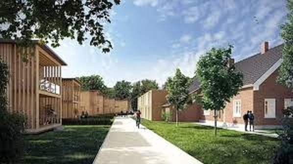
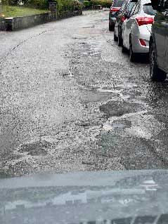

\page Thema02_8md TOP 2: Baugebiet und Quartiersentwicklung

## Nachhaltigkeit - Zukunft gestalten, Zukunft erhalten

Das Thema Nachhaltigkeit umfasst in unserer Gemeinde alle Bestrebungen und Maßnahmen, die darauf abzielen, langfristig eine lebenswerte Umgebung für die Bewohner zu schaffen, ohne dabei die Ressourcen für künftige Generationen zu erschöpfen.
Das ist für uns kein Lippenbekenntnis, sondern bezieht sich auf ökologische, soziale und ökonomische Aspekte und zielt auf eine ausgewogene Entwicklung, die Umweltschutz, soziale Gerechtigkeit und wirtschaftliches Wachstum miteinander verbindet.
Das ist unser Antrieb für unsere Zukunft.

## Quartiersentwicklung, Mehrgenerationenwohnen und bezahlbarer Wohnraum – für uns Themen mit Zukunft

Die Quartiersentwicklung ist ein wichtiger Aspekt bei der Schaffung lebenswerter und bezahlbarer Wohnräume und stellt die gesamtheitliche Planung zur Weiterentwicklung eines Wohngebietes dar.
Darin lässt sich eine Vielzahl von Aspekten wie Wohnen, ärztliche Versorgung (z.B. über ein Medizinisches Versorgungszentrum (MVZ)), Arbeiten, Freizeit, Mobilität, Umwelt, soziale Integration und wirtschaftliche Entwicklung in einem integrierten Ansatz betrachten, um die Bedürfnisse der Bewohner zu berücksichtigen.

Ein weiterer wichtiger Ansatz dabei ist das Mehrgenerationenwohnen.
Dies fördert nicht nur den Austausch und die Interaktion zwischen Menschen unterschiedlichen Alters, sondern trägt auch zur Entwicklung eines vielfältigen und lebendigen Quartiers bei.
Durch die Zusammenführung von Menschen verschiedener Generationen entsteht ein unterstützendes soziales Netzwerk, in dem sich Bewohner gegenseitig helfen und unterstützen können.
Dies fördert maßgeblich die Steigerung der Lebensqualität und sorgt für ein respektvolles Miteinander.

Ein weiterer Vorteil von Mehrgenerationenwohngebieten liegt in der effizienten Mehrfachnutzung von Ressourcen.
Durch gemeinsam genutzte Einrichtungen wie Küchen, Waschräume und Gemeinschaftsräume können Kosten gesenkt und die Umweltbelastung reduziert werden.
Dies trägt zu einer nachhaltigen Quartiersentwicklung bei, die sowohl ökologische als auch ökonomische Vorteile bietet.

Die gegenseitige Unterstützung bei der Kinderbetreuung oder der Versorgung älterer Mitmenschen ist ein weiterer wichtiger Aspekt.
Dies fördert nicht nur die Verbundenheit innerhalb der Gemeinschaft, sondern entlastet auch individuelle Haushalte und trägt zur Vereinbarkeit von Familie und Beruf bei.

Die gegenseitige Unterstützung bei der Kinderbetreuung oder der Versorgung älterer Mitmenschen ist ein weiterer wichtiger Aspekt.
Dies fördert nicht nur die Verbundenheit innerhalb der Gemeinschaft, sondern entlastet auch individuelle Haushalte und trägt zur Vereinbarkeit von Familie und Beruf bei.
Die Bezahlbarkeit von Wohnraum hängt oftmals stark von den aktuell zu Verfügung stehenden staatlichen Förderprogrammen, Sozialwohnungsbauprogrammen und Steuervorteilen ab welche gezielt geprüft werden sollten, um die Rentabilität von Wohnprojekten mit niedrigeren Mieten zu erhöhen.
Das Erbbaurecht kann ebenfalls eine Lösung sein, indem es beiden Parteien ermöglicht, die Nutzung und Entwicklung des Grundstücks gemeinsam zu planen und umzusetzen.

Weitere innovative Ansätze im Wohnungsbau, wie modulare Bauweise, Nutzung kostengünstiger Baumaterialien oder alternative Bauformen wie Tiny Houses, können ebenfalls zur Schaffung von bezahlbarem Wohnraum beitragen.
Eine Überprüfung und Anpassung von Bauregulierungen und Vorschriften kann zudem bürokratische Hindernisse beseitigen und den Bau bezahlbarer Wohnräume erleichtern, ohne dabei die Sicherheit und Qualität zu vernachlässigen.

Durch die Umsetzung dieser Maßnahmen streben wir an, die Schaffung von bezahlbarem Wohnraum zu fördern und sicherzustellen, dass alle Bewohnerinnen und Bewohner Zugang zu angemessenem, lebenswertem und erschwinglichem Wohnraum haben und gleichzeitig ein lebendiges und nachhaltiges Quartier für unsere Heimat entsteht.

## Eigenkontrollverordnung, Straßen und Brücken

Die Eigenkontrollverordnung regelt, dass die Verantwortung für die Kontrolle und Instandhaltung von Straßen und Brücken bei den Kommunen liegt.
Diese sind verpflichtet, die Infrastruktur im Ort im Auge zu behalten und regelmäßig zu überprüfen.
Bei Bedarf müssen Sanierungsmaßnahmen eingeleitet werden, um die Sicherheit und Funktionsfähigkeit der Straßen und Brücken zu gewährleisten.
Es ist wichtig, dass die Verantwortlichen die Infrastruktur kontinuierlich überwachen und instandhalten, um Unfälle und Schäden zu vermeiden.

## Kommunale Wärmeplanung - was kommt da auf uns zu?

Alle Kommunen stehen in den nächsten Jahren vor einer Reihe von Herausforderungen und Anforderungen an die kommunale Wärmeplanung, die sich aus dem zunehmenden Druck zur Reduzierung der CO2-Emissionen, der Notwendigkeit der Energiewende und den Erwartungen der Bürger an eine nachhaltige und kosteneffiziente Wärmeversorgung ergeben.
Kommunale Wärmeplanung ist ein komplexer Prozess, der strategisches Denken, interdisziplinäre Zusammenarbeit und die Einbindung lokaler Akteure erfordert, um die gesetzlichen Anforderungen zu erfüllen.

Diese Vorgaben fließen direkt in konkrete Entwicklungen der Kommune ein, um eine effiziente, nachhaltige und zukunftsfähige Wärmeversorgung zu gewährleisten.
Dies erfordert eine vorausschauende Planung und Koordination sowieeine gewisse (auch technische) Flexibilität, um Synergien zu nutzen und Konflikte zu vermeiden.
Da die Umsetzung dieser Maßnahmen oft mit erheblichen Investitionen verbunden ist, gilt es Finanzierungsmodelle zu entwickeln, die sowohl für die Kommune als auch für private Haushalte und Unternehmen tragbar sind.

Dies kann die Nutzung von Fördermitteln, die Entwicklung von Betreibermodellen oder die Einbindung privater Investoren umfassen.
Für uns ist eine frühzeitige Einbindung der Bürger in Verbindung mit einer transparenten Kommunikation und der Ermöglichung von Bürgerbeteiligung ist dabei ein wichtiger Erfolgsfaktor und stellt Unsere Werte dar.

## Umweltverträgliche Ortsplanung - wie hilft sie uns?

Eine umweltfreundliche Ortsplanung in den Gemeinden kann verschiedene Aspekte berücksichtigen, um eine nachhaltige und lebenswerte Umgebung für die Bewohner zu schaffen.

Im Bereich der Mobilität ist die Förderung des öffentlichen Verkehrs und der Fahrradinfrastruktur - wie sie derzeit aktiv angegangen wird - ein wichtiges Element, um den Autoverkehr zu reduzieren.
Sichere Gehwege sind ein weiteres Element, um den Fußgängerverkehr zu erleichtern.
Das geplante Car-Sharing-System wird auch bei uns in Zukunft an Bedeutung gewinnen.

Bei anstehenden Bau- und Sanierungsvorhaben, auch bei gemeindeeigenen Projekten, werden wir auf die Energieeffizienz der Maßnahmen achten und die Nutzung regenerativer Ressourcen einfordern.
Dazu gehören die Bereiche Energieerzeugung sowie Gebäudeeffizienz durch geringen Heizwärmebedarf, Gebäudesteuerung und z.B. Regenwassernutzung oder Dachbegrünung zur Förderung der Biodiversität und Vermeidung von Hitzeinseln.

Das Thema Abfallvermeidung wird in Zukunft weiter an Bedeutung gewinnen.
Mehrwegverpackungen und der Einkauf bei regionalen Produzenten und Anbietern sind hier bereits ein sinnvoller Schritt.
Darüber hinaus können viele Produkte durch Reparatur weiter genutzt werden.
So könnte der Warentauschtag durch ein Repair-Café ergänzt werden.
Was dann noch übrig bleibt, wird sauber getrennt entsorgt.
