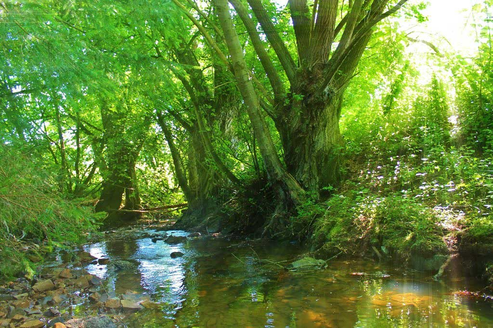

\page Thema03_8md TOP 3: Die Talbachrenaturierung

Die Talbachrenaturierung ist ein
wichtiger Bestandteil des Hochwasserschutzes,
da natürliche Bachläufe dazu
beitragen können, Hochwasser besser zu
kontrollieren und abzuleiten. Durch die
Renaturierung der Talbachläufe können
ökologische Lebensräume verbessert und
die Biodiversität gefördert werden. Darüber
hinaus trägt die Renaturierung dazu
bei, dass das Wasser besser versickern
kann und somit das Grundwasser langfristig
sichert. Zusätzlich können dadurch
wertvolle Öko- bzw. Ausgleichspunkte
angerechnet werden – wir sehen uns
dabei als aktive Unterstützer in diesen
Prozessen.

